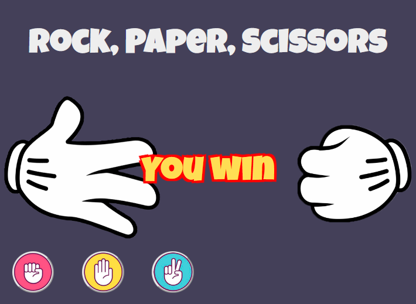

When a user clicks on on of the three buttons (rock, paper, or scissors), the program generates a "computer's choice" and check the combination of user's and computer's choices in order to determine the winner.

Animation is being played for every round, and it shows the chosen user's and computer's figures at the end.
